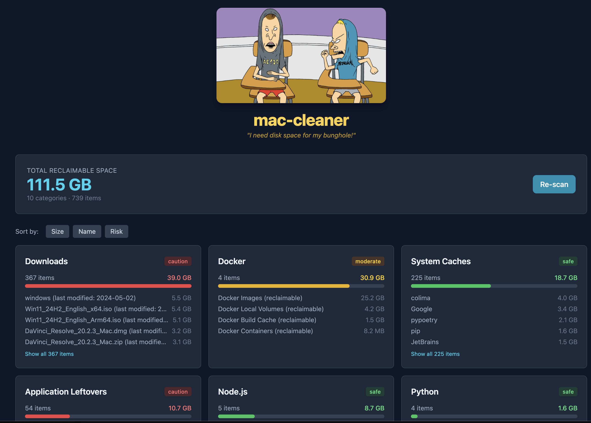

<p align="center">
  
</p>

<h1 align="center">mac-cleaner</h1>

<p align="center">
  <em>"I need disk space for my bunghole!"</em>
</p>

<p align="center">
  A fast, safe macOS disk cleanup utility for developers.<br>
  Scans and removes caches, build artifacts, and unnecessary files from development tools.
</p>

<p align="center">
  <a href="https://github.com/aviv4339/mac-cleaner/actions/workflows/ci.yml"></a>
  <a href="https://goreportcard.com/report/github.com/aviv4339/mac-cleaner"></a>
  <a href="LICENSE"></a>
</p>

---

<p align="center">
  
</p>

---

## Features

- **17 scan categories** covering all major development tools
- **Safe by default** — never deletes without explicit confirmation
- **Risk-level indicators** — know what's safe to delete
- **Web dashboard** — interactive browser-based report with HTMX
- **Fast parallel scanning** — concurrent category scanning
- **JSON output** — pipe results to other tools
- **Color-coded terminal output** — instantly spot the biggest offenders
- **Docker-aware** — detects Docker disk usage via `docker system df`

## Quick Start

```bash
# Install
brew tap aviv4339/tap && brew install mac-cleaner

# Scan your system
mac-cleaner scan

# Launch the web dashboard
mac-cleaner report

# Clean up interactively
mac-cleaner clean
```

## Installation

### Homebrew (recommended)

```bash
brew tap aviv4339/tap
brew install mac-cleaner
```

### Download Binary

Download the latest release from the [Releases page](https://github.com/aviv4339/mac-cleaner/releases).

```bash
# Apple Silicon (M1/M2/M3)
curl -LO https://github.com/aviv4339/mac-cleaner/releases/latest/download/mac-cleaner_darwin_arm64.tar.gz
tar xzf mac-cleaner_darwin_arm64.tar.gz
sudo mv mac-cleaner /usr/local/bin/

# Intel Mac
curl -LO https://github.com/aviv4339/mac-cleaner/releases/latest/download/mac-cleaner_darwin_amd64.tar.gz
tar xzf mac-cleaner_darwin_amd64.tar.gz
sudo mv mac-cleaner /usr/local/bin/
```

### Build from Source

```bash
git clone https://github.com/aviv4339/mac-cleaner.git
cd mac-cleaner
make build
# Binary is in bin/mac-cleaner
```

## Usage

### `scan` — Find reclaimable space

```bash
mac-cleaner scan                            # Scan everything
mac-cleaner scan -c homebrew,docker,xcode   # Specific categories
mac-cleaner scan --min-size 1GB             # Filter by size
mac-cleaner scan --json                     # JSON output
mac-cleaner scan --no-color                 # No ANSI colors
```

### `clean` — Free up disk space

```bash
mac-cleaner clean                           # Interactive cleanup
mac-cleaner clean --dry-run                 # Preview only
mac-cleaner clean -c homebrew,trash         # Specific categories
mac-cleaner clean --force                   # Skip confirmation
```

### `report` — Web dashboard

```bash
mac-cleaner report                          # Open dashboard in browser
mac-cleaner report --port 9090              # Custom port
mac-cleaner report --no-browser             # Server only
```

Runs a scan and opens a dark-themed web dashboard at `http://127.0.0.1:8080` with:

- Total reclaimable space summary with re-scan button
- Category cards with risk badges and proportional size bars
- Sort controls (by size, name, or risk level)
- Expandable entry lists per category
- Live updates powered by HTMX — no page reloads

Press `Ctrl+C` to stop the server.

## Scan Categories

| Category | Name | Risk | What it scans |
|----------|------|------|---------------|
| Homebrew | `homebrew` | Safe | `~/Library/Caches/Homebrew` — old formula downloads |
| Docker | `docker` | Moderate | Images, containers, volumes, build cache via `docker system df` |
| Xcode | `xcode` | Safe | DerivedData, Archives, iOS DeviceSupport, Simulators |
| Node.js | `node` | Safe | npm/yarn/pnpm caches |
| Python | `python` | Safe | pip cache, conda packages |
| Rust | `rust` | Safe | Cargo registry cache |
| Go | `go` | Safe | Module cache (`~/go/pkg/mod/cache`) |
| Ruby | `ruby` | Safe | Gem cache, Bundler cache |
| Java/Kotlin | `java` | Moderate | Gradle caches, Maven repository |
| System Caches | `system-caches` | Safe | `~/Library/Caches/*` per-app breakdown |
| System Logs | `system-logs` | Safe | `~/Library/Logs` |
| Trash | `trash` | Safe | `~/.Trash` |
| Downloads | `downloads` | Caution | Files in `~/Downloads` older than 30 days |
| App Leftovers | `app-leftovers` | Caution | Application Support data for uninstalled apps |
| Mail | `mail` | Moderate | Cached mail attachments |
| Composer | `composer` | Safe | PHP Composer cache |
| CocoaPods | `cocoapods` | Safe | CocoaPods spec and download caches |

### Risk Levels

| Level | Meaning |
|-------|---------|
| **Safe** | Pure caches — will be regenerated automatically. No data loss. |
| **Moderate** | Packages and images that will need to be re-downloaded if needed again. |
| **Caution** | Review before deleting. May contain data you want to keep. |

## Flags Reference

### Global

| Flag | Description |
|------|-------------|
| `--no-color` | Disable colored terminal output |

### `scan`

| Flag | Short | Description |
|------|-------|-------------|
| `--all` | | Scan all categories (default) |
| `--category` | `-c` | Scan specific categories (comma-separated) |
| `--min-size` | | Minimum size to display (e.g., `100MB`, `1GB`) |
| `--json` | | Output results as JSON |
| `--top` | `-n` | Number of items to show per category (default: 10) |
| `--full-paths` | | Show full file paths |

### `clean`

| Flag | Short | Description |
|------|-------|-------------|
| `--dry-run` | | Preview without deleting |
| `--force` | `-f` | Skip confirmation prompts |
| `--category` | `-c` | Clean specific categories (comma-separated) |

### `report`

| Flag | Short | Description |
|------|-------|-------------|
| `--port` | `-p` | Port for the web server (default: `8080`) |
| `--no-browser` | | Don't auto-open browser |

## Examples

```bash
# Quick overview of disk usage
$ mac-cleaner scan

# Clean up just the safe stuff
$ mac-cleaner clean -c homebrew,trash,system-caches

# Pipe to jq for scripting
$ mac-cleaner scan --json | jq '.[] | select(.total_size > 1073741824)'

# Launch dashboard on a custom port
$ mac-cleaner report -p 3000
```

## Development

```bash
make build        # Build binary to bin/mac-cleaner
make test         # Run tests
make test-cover   # Run tests with coverage
make lint         # Lint
make fmt          # Format code
```

## Contributing

Contributions are welcome! Please:

1. Fork the repository
2. Create a feature branch (`git checkout -b feature/amazing`)
3. Commit your changes (`git commit -m 'Add amazing feature'`)
4. Push to the branch (`git push origin feature/amazing`)
5. Open a Pull Request

## License

MIT — see [LICENSE](LICENSE) for details.
